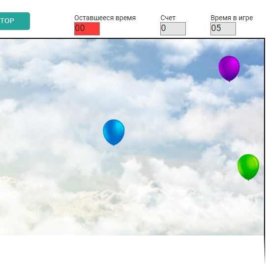
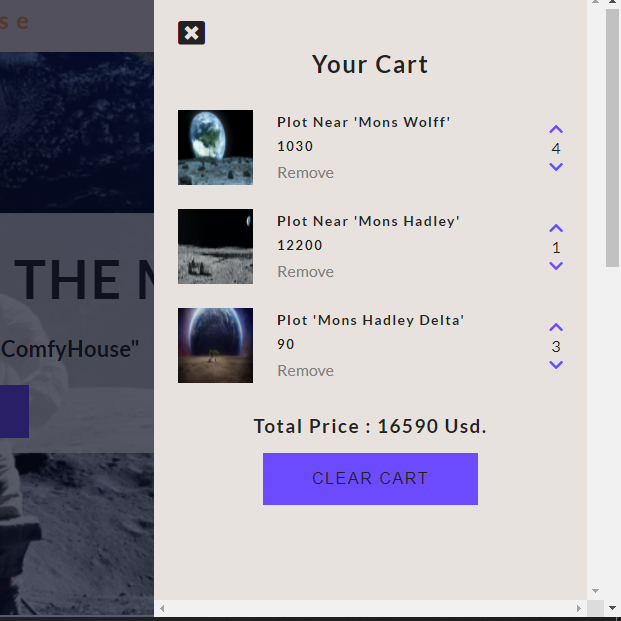
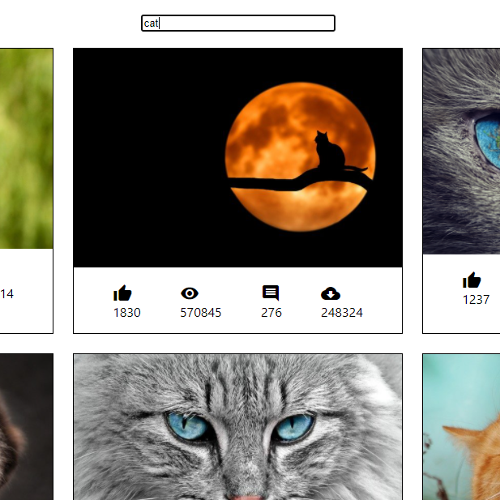
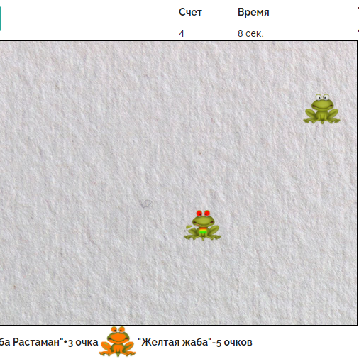

## I'm a frontend junior developer

- 🔭 I’m currently working on many interesting things
- 📫 How to reach me: devidoz666@gmail.com

### My stack and tools

  

### My statistics

<!--  -->

<!--  -->

 

### My project

